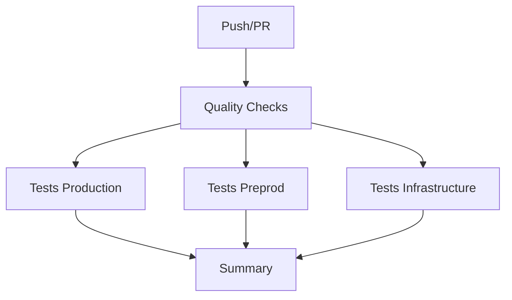
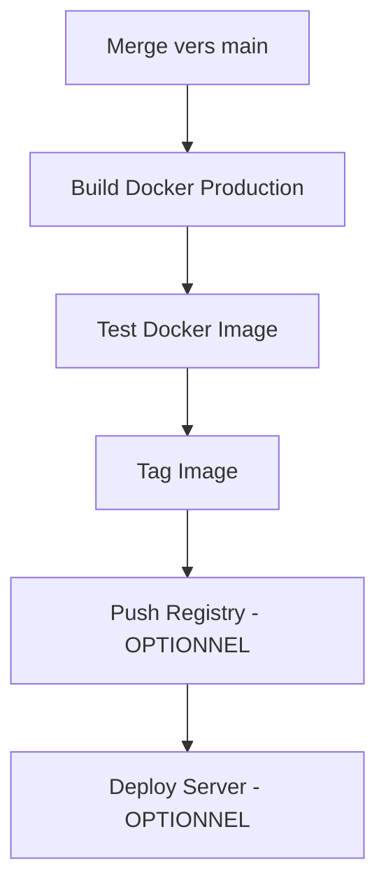

# GitHub Actions Workflows

## Vue d'ensemble

Ce répertoire contient les workflows GitHub Actions pour le CI/CD du projet Mangetamain Analytics.

## Workflows disponibles

### 1. `ci.yml` - Pipeline CI (Intégration Continue)

**Déclencheurs:**
- ✅ Push sur n'importe quelle branche
- ✅ Pull Request vers `main`
- ✅ Déclenchement manuel (workflow_dispatch)

**Jobs exécutés:**



**Durée estimée:** ~3-4 minutes

**Détails des checks:**
- **Quality Checks**: PEP8, Black, Pydocstyle, Mypy
- **Tests Production**: pytest avec coverage >= 90% sur `20_prod/`
- **Tests Preprod**: pytest avec coverage >= 90% sur `10_preprod/`
- **Tests Infrastructure**: Tests S3/DuckDB/Docker (continue si échec)

### 2. `deploy.yml` - Pipeline CD (Déploiement Continu)

**Déclencheurs:**
- ✅ Push sur `main` uniquement
- ✅ Déclenchement manuel (workflow_dispatch)

**Jobs exécutés:**



**Durée estimée:** ~2-3 minutes (sans déploiement réel)

**Note:** Le déploiement automatique est configuré mais commenté. Pour l'activer, voir [README_CI_CD.md](../../README_CI_CD.md).

## Configuration requise

### Secrets GitHub (pour déploiement optionnel)

Pour activer le déploiement automatique, configurer ces secrets dans:
`Settings > Secrets and variables > Actions`

```
DOCKER_USERNAME     # Username Docker Hub
DOCKER_PASSWORD     # Token Docker Hub
SERVER_HOST         # IP/domaine du serveur
SERVER_USER         # Utilisateur SSH
SERVER_SSH_KEY      # Clé privée SSH
```

## Badges de statut

Ajouter ces badges au README principal :

```markdown
[](https://github.com/USERNAME/REPO/actions/workflows/ci.yml)
[](https://github.com/USERNAME/REPO/actions/workflows/deploy.yml)
```

## Logs et artefacts

### Accéder aux logs
1. Aller sur GitHub → Actions
2. Cliquer sur le workflow (CI Pipeline / CD Pipeline)
3. Sélectionner une exécution (run)
4. Cliquer sur un job pour voir les logs détaillés

### Télécharger les rapports de coverage
1. Aller dans une exécution du workflow CI
2. Scroller vers le bas → Section "Artifacts"
3. Télécharger `coverage-report-prod` ou `coverage-report-preprod`
4. Décompresser et ouvrir `index.html`

## Déboguer un échec de workflow

### Étape 1: Identifier le job qui a échoué
```
CI Pipeline → Cliquer sur l'exécution → Voir le job rouge
```

### Étape 2: Lire les logs
```
Cliquer sur le job → Expander les étapes → Lire l'erreur
```

### Étape 3: Reproduire localement
```bash
cd /home/julien/code/mangetamain/000_dev
./run_ci_checks.sh prod
```

### Étape 4: Corriger et re-push
```bash
# Corriger le code
git add .
git commit -m "fix: correction erreur CI"
git push
```

## Performance et optimisation

### Cache des dépendances
Les workflows utilisent `uv` qui est très rapide. Pas besoin de cache supplémentaire pour le moment.

### Parallélisation
Les tests sont exécutés en parallèle :
- Quality Checks (séquentiel)
- Tests Production (parallèle après Quality)
- Tests Preprod (parallèle après Quality)
- Tests Infrastructure (parallèle après Quality)

### Temps d'exécution typiques
| Job | Durée |
|-----|-------|
| Quality Checks | ~30s |
| Tests Production | ~45s |
| Tests Preprod | ~50s |
| Tests Infrastructure | ~20s |
| **Total** | **~3 min** |

## Maintenance

### Mise à jour des versions Python
Éditer `.github/workflows/ci.yml` et `.github/workflows/deploy.yml`:
```yaml
- name: Set up Python 3.13
  uses: actions/setup-python@v5
  with:
    python-version: '3.13'  # Changer ici
```

### Ajouter un nouveau check
1. Éditer `.github/workflows/ci.yml`
2. Ajouter une nouvelle étape dans le job `quality-checks`
3. Tester localement avec `./run_ci_checks.sh`
4. Commit et push

### Modifier le seuil de coverage
Éditer `pyproject.toml` dans `10_preprod/` et `20_prod/`:
```toml
[tool.pytest.ini_options]
addopts = "--cov-fail-under=90"  # Changer ici
```

## Support

Pour toute question sur les workflows GitHub Actions :
- 📚 [Documentation complète CI/CD](../../README_CI_CD.md)
- 🔧 [GitHub Actions Documentation](https://docs.github.com/en/actions)
- 🐛 [Créer une issue](https://github.com/USERNAME/REPO/issues)

---

**Dernière mise à jour:** 2025-10-23
**Version:** 1.0
